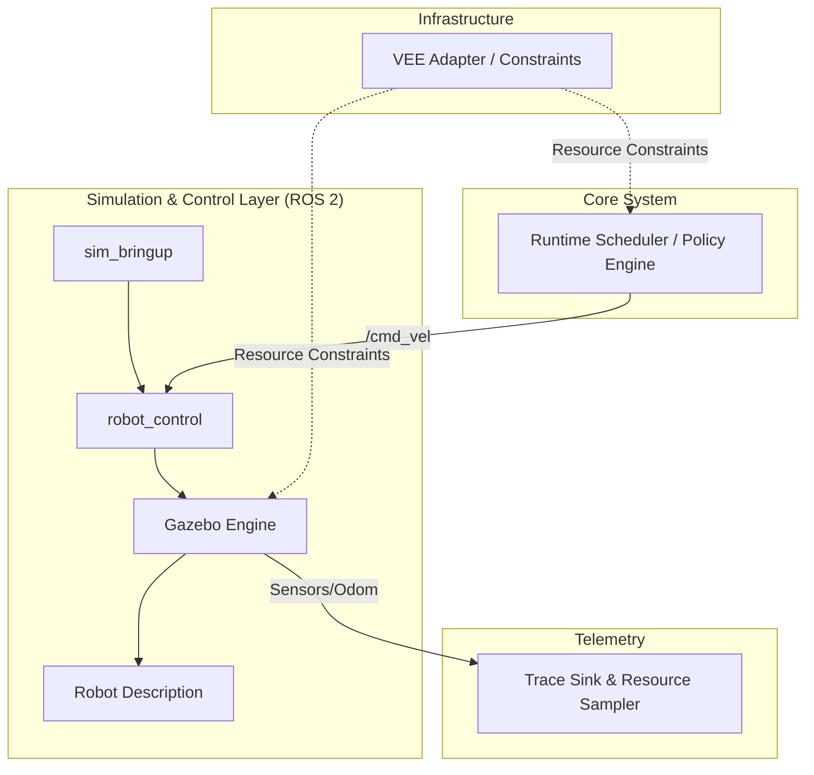

# Runtime Scheduler

## Architecture Overview



### Component Details

- **Runtime Scheduler / Policy Engine**: 系统的核心大脑，负责任务调度、工作负载生成及执行策略的决策。它通过感知环境状态，向控制层发布指令，并协调 Agent 任务的生命周期。
- **Simulation & Control Layer**: 集成 ROS 2 仿真栈，通过 URDF 描述机器人物理特性，利用 Gazebo 和 `ros2_control` 实现底层的精确动力学控制。边界在于处理物理交互与底层硬件接口封装。
- **Telemetry**: 负责全链路追踪（Trace）与指标记录，通过资源采样器实时监控系统运行数据，为启发式实验提供量化分析证据。
- **Infrastructure (VEE)**: 基础设施适配器，提供计算资源限制能力。通过动态注入约束（如 CPU/内存限制），实现对仿真环境及调度程序的运行时性能控制。

Run the baseline runtime experiment with:

```bash
python -m runtime_scheduler.main
```

The run writes traces under `traces/<YYYYMMDD-HHMMSS>/` and produces five JSONL files:

- `window_observation.jsonl`
- `plan.jsonl`
- `outcome.jsonl`
- `task_events.jsonl`
- `resource_samples.jsonl`

## Gazebo + ros2_control bringup

### Build

```bash
colcon build --symlink-install
source install/setup.bash
```

### Launch simulation stack

```bash
ros2 launch sim_bringup sim_stack.launch.py
```

### Verify controllers

```bash
ros2 control list_controllers
```

Expected: `joint_state_broadcaster` and `diff_drive_controller` are `active`.

### Send motion command

```bash
ros2 topic pub /cmd_vel geometry_msgs/msg/Twist "{linear: {x: 0.1}, angular: {z: 0.2}}" -r 10
```

### Acceptance checks

- Gazebo robot moves after `/cmd_vel`
- `/joint_states` updates continuously
- `/scan` and `/camera/image_raw` publish data
- `/clock` is available with sim time

## HAMi-core in VEE Container

Clone/build HAMi-core into `libs/` and produce `libs/libvgpu.so`:

```bash
make hami-core-prepare
```

Run a container smoke test with `LD_PRELOAD=libs/libvgpu.so`:

```bash
make vee-hami-smoke
```

Optional env overrides:

```bash
HAMI_CORE_LIB=/abs/path/libvgpu.so \
CUDA_IMAGE=nvidia/cuda:12.4.1-runtime-ubuntu22.04 \
CUDA_DEVICE_MEMORY_LIMIT=1g \
CUDA_DEVICE_SM_LIMIT=50 \
make vee-hami-smoke
```

If output hangs at `Initializing.....`, retry with a longer timeout and debug logs:

```bash
HAMI_SMOKE_TIMEOUT_SEC=90 LIBCUDA_LOG_LEVEL=4 make vee-hami-smoke
```

The smoke script will auto-clean lock/cache before running:
- `/tmp/vgpulock/lock`
- `$CUDA_DEVICE_MEMORY_SHARED_CACHE` (default `/tmp/cudevshr.$$.cache`)

It also sets for smoke mode:
- `GPU_CORE_UTILIZATION_POLICY=DISABLE`
